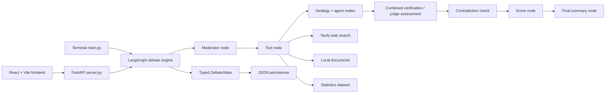

# Debate Arena

**Debate Arena** is an evidence-driven AI debate environment where two
specialized agents argue opposing positions, a moderator controls the flow,
and every turn is checked, scored, and persisted. The project includes a
terminal experience and a React web interface backed by the same LangGraph
debate engine.

## 🎯 Problem Statement

The repository has two interfaces over the same debate engine:

```
backend/    The original AI Debate Arena engine (unchanged) + a new server.py
            that exposes it over HTTP for the web frontend.
frontend/   A new React + Vite web UI: professional design,
            dark/light mode, live scoring, moderator controls.
```

Traditional online debates are difficult to evaluate objectively:

- participants can make unsupported claims;
- evidence can be scattered or hard to verify;
- speakers may contradict their own earlier statements;
- debate quality is difficult to compare consistently;
- moderators must manually track arguments, evidence, contradictions, and
  outcomes; and
- there is no structured way to combine evidence quality, engagement, and
  reasoning into one result.

Debate Arena addresses this with a structured, AI-driven debate workflow:

- Elena and Marcus argue opposing positions;
- a moderator controls the next turn and can challenge either speaker;
- agents gather evidence from web search, local documents, and a statistics
  dataset;
- factual claims receive explicit verdicts;
- self-contradictions can be surfaced and resolved;
- debate performance is scored across multiple signals; and
- a final summary explains the result, supporting evidence, weak points,
  contradictions, and winner using the recorded debate state.
 
## ✨ Features

- **AI-vs-AI debates** between Elena and Marcus, with fixed but complementary
  debate roles.
- **Turn-based flow** across Opening, Evidence, Rebuttal,
  Cross-Examination, and Closing phases.
- **Moderator controls** for Continue, Challenge Elena, Challenge Marcus,
  Request Evidence, Request Rebuttal, Ask Clarification, Expose Contradiction,
  End Debate, and free-form prompts.
- **Evidence gathering** through Tavily web search, local document retrieval,
  a local statistics dataset, safe mathematical evaluation, and trend
  simulation.
- **Source attribution** with title, URL, snippet, agent, turn, and query
  records stored in the debate state.
- **Claim verification** with verdicts such as `SUPPORTED`,
  `PARTIALLY_SUPPORTED`, `NOT_SUPPORTED`, `CONTRADICTED`, and
  `INSUFFICIENT_EVIDENCE`.
- **Contradiction detection and resolution** for claims that conflict with a
  speaker's own earlier claims.
- **Multi-signal scoring** with evidence grounding, AI-judged argument
  quality, direct engagement, clarity, and penalties for contradictions or
  overclaims.
- **Final summaries** generated from the transcript and recorded analytics.
- **Local persistence** with autosaved JSON debates, history, resume, and
  replay support.
- **Offline mode** using the built-in fake chat model for state-machine
  development and tests.
- **Responsive web dashboard** with live messages, source links, claim
  verdict counts, score meters, contradiction alerts, history, and light/dark
  theme support.

## 🏗️ Architecture



### Major components

| Component | Responsibility |
| --- | --- |
| `frontend/src/` | React UI for starting, viewing, moderating, and revisiting debates. |
| `frontend/src/api/client.js` | Fetch wrapper for the backend API. |
| `frontend/vite.config.js` | Vite development server and `/api` proxy to port `8000`. |
| `backend/server.py` | FastAPI orchestration layer for debate creation, state serialization, resume, and moderator actions. |
| `backend/main.py` | Terminal UI, CLI moderator menu, rendering, history, replay, and resume. |
| `backend/arena/graph.py` | LangGraph nodes and conditional routing. |
| `backend/arena/state.py` | Typed shared `DebateState` passed between graph nodes. |
| `backend/arena/agents.py` | Moderator, research/tool, strategy, speaker, verification, scoring, and summary nodes. |
| `backend/arena/evidence.py` | Structured evidence, claim verdicts, source credibility, and combined assessment. |
| `backend/arena/tools.py` | Web search, local retrieval, dataset lookup, math, and trend tools. |
| `backend/arena/persistence.py` | Local JSON autosave, listing, loading, resume, and replay support. |
| `backend/data/` | Local documents, evaluation topics, statistics, and the ignored debate-data directory. |

Each graph invocation processes one debate turn and returns control to the
caller. This is what allows the CLI and web moderator to intervene between
turns instead of waiting for an entire debate to finish.

## 🔄 How It Works

1. A user enters a topic in the web UI or starts `main.py`.
2. The application creates a `DebateState` with the topic, speakers, score
   ledgers, evidence log, contradiction list, and persistence ID.
3. The moderator node determines whether to continue, redirect a speaker,
   inject an action prompt, or finish the debate.
4. The selected speaker's tool node gathers relevant context:
   - stance-specific Tavily results;
   - matching local documents;
   - matching statistics;
   - optional math or trend calculations.
5. The strategy and agent nodes generate the speaker's turn.
6. The combined assessment extracts claims, assigns verdicts, judges
   rebuttal/logic/clarity, and checks for self-contradictions.
7. The score node updates grounding, AI judge, activity, and weighted
   composite totals.
8. The state is autosaved and returned to the CLI or API client.
9. At the end of the configured turn budget, unresolved contradictions can
   hold the debate at moderator control. The moderator can expose one or
   explicitly continue before summary generation.
10. The summary node produces the final explanation, winner, margin, and
    confidence label.

## 🤖 AI Debate System

### Elena

Elena is the evidence-first side of the debate. Her turns use the shared
research pipeline and are framed to build a supported position.

### Marcus

Marcus is the opposing pragmatic systems thinker. He uses the same graph,
tool access, verification, and scoring rules as Elena; only the position and
generated content differ.

### Moderator

The moderator is available between turns in both interfaces. Structured
actions map to existing prompt templates, while free-form text is injected as
the next turn's moderator context. Challenge actions can target a specific
speaker, and `Expose Contradiction` targets the latest unresolved item.

### Evidence and search

The tool layer combines live Tavily search with local keyword-ranked document
retrieval and a JSON statistics dataset. Search results are retained as
structured source records rather than only flattened prompt text.

### Judge and scoring system

The assessment call performs three jobs in one pass:

1. fact-check claims against evidence from the current turn;
2. judge rebuttal, logic, clarity, and engagement; and
3. compare new claims with the same speaker's earlier claims.

The online assessment model has its own token budget, while offline mode uses
the shared deterministic fake model used by the tests.

## 🧠 Evidence & Fact Checking

For each research turn, source records include:

```text
title, url, snippet, agent, turn, query
```

The assessment extracts up to three claims and assigns one of five verdicts:

| Verdict | Meaning |
| --- | --- |
| `SUPPORTED` | The available evidence directly supports the claim. |
| `PARTIALLY_SUPPORTED` | The evidence supports only part of the claim. |
| `NOT_SUPPORTED` | The available evidence does not support the claim. |
| `CONTRADICTED` | The available evidence conflicts with the claim. |
| `INSUFFICIENT_EVIDENCE` | There is not enough evidence to decide. |

Evidence grounding is not a raw model score. The project derives a
deterministic score from the verdicts and overclaim flags, then blends it with
the assessment model's estimate. Source credibility is also blended with a
rule-based domain tier classifier. This keeps the dashboard tied to the
actual claims and URLs recorded for the turn.

## ⚠️ Contradiction Detection

Contradictions are about a speaker reversing or materially conflicting with
their **own** earlier claims, not simply disagreeing with the opponent.

1. The combined assessment compares the current speech with prior claims by
   the same speaker.
2. A detected contradiction is appended to the shared state with the speaker,
   turn, conflicting claim, explanation, and unresolved status.
3. The dashboard surfaces unresolved contradictions.
4. The moderator selects **Expose Contradiction**, which creates a targeted
   clarification prompt and marks the latest unresolved contradiction as
   resolved.
5. A resolved contradiction no longer blocks summary routing.
6. If an unresolved contradiction exists at the final scored turn, the graph
   returns control to the moderator instead of entering the final summary.
7. The moderator may resolve it or explicitly choose Continue before summary
   generation.

New contradictions and overclaimed inferences also affect the weighted
composite score through explicit penalties.

## 📊 Scoring

The winner is determined by cumulative weighted composite scores:

| Metric | Weight | Source |
| --- | ---: | --- |
| Evidence grounding | 35% | Deterministic verdict score blended with the assessment model |
| Rebuttal quality | 25% | Combined AI assessment; capped when engagement is absent |
| Logical consistency | 20% | Combined AI assessment |
| Direct engagement | 10% | Rule-based activity/momentum calculation |
| Clarity | 10% | Combined AI assessment |

Additional rules:

- A newly detected contradiction subtracts 10 composite points.
- Each overclaimed inference subtracts 5 composite points.
- Composite scores are floored at zero.
- The final summary reports the winner, margin, and confidence:
  `HIGH`, `MODERATE`, or `TOO_CLOSE_TO_CALL`.
- Activity/momentum remains visible as an informational metric and does not
  independently determine the winner in normal mode.
- `LITE_MODE=true` skips the combined assessment and uses the rule-based
  activity score as the decision signal for that run.

## 🛠️ Tech Stack

| Layer | Technologies |
| --- | --- |
| Backend language | Python |
| Debate orchestration | LangGraph, LangChain |
| Online model provider | Groq via `langchain-groq` |
| Offline model | LangChain `FakeListChatModel` |
| Web API | FastAPI, Uvicorn |
| Web evidence | Tavily |
| Terminal UI | Rich |
| Frontend | React 18, React DOM |
| Frontend tooling | Vite |
| Persistence | Local JSON files |
| Testing | pytest |
| Configuration | `python-dotenv` |

## 📁 Project Structure

```text
debate-arena/
├── backend/
│   ├── arena/
│   │   ├── agents.py          # graph nodes and agent behavior
│   │   ├── config.py          # provider/model factories
│   │   ├── evidence.py        # claims, verdicts, grounding, assessments
│   │   ├── graph.py           # LangGraph construction and routing
│   │   ├── persistence.py     # JSON autosave, history, resume, replay
│   │   ├── phases.py          # five-phase turn schedule
│   │   ├── state.py           # shared DebateState schema
│   │   └── tools.py           # search, documents, data, math, trends
│   ├── data/
│   │   ├── documents/         # local retrieval corpus
│   │   ├── eval_topics.json   # evaluation prompts
│   │   ├── stats.json         # local statistics dataset
│   │   └── debates/.gitkeep   # runtime debate data is gitignored
│   ├── docs/                  # project design and testing notes
│   ├── scripts/               # evaluation and model-comparison tools
│   ├── tests/                 # backend test suite
│   ├── .env.example           # environment variable names
│   ├── main.py                # terminal application
│   ├── requirements.txt       # Python dependencies
│   └── server.py              # FastAPI application
├── frontend/
│   ├── src/
│   │   ├── api/client.js      # backend request client
│   │   └── components/        # debate UI, stats, chat, history
│   ├── package.json
│   ├── package-lock.json
│   └── vite.config.js
├── .gitignore
└── README.md
```

Runtime debate JSON files are intentionally excluded from version control.

## 🚀 Getting Started

### Prerequisites

- Python 3.10+ recommended
- Node.js and npm
- A Groq API key for online model mode
- A Tavily API key for live web evidence

Offline mode can run the debate state machine without those API keys.

### Backend setup

From the repository root:

```bash
cd backend
python -m venv .venv
```

Activate the environment:

```bash
# Windows PowerShell
.venv\Scripts\Activate.ps1

# macOS/Linux
source .venv/bin/activate
```

Install dependencies:

```bash
python -m pip install -r requirements.txt
python -m pip install fastapi uvicorn
```

The FastAPI/Uvicorn packages are required by `server.py`; the core dependency
file contains the debate engine and tool dependencies.

### Environment variables

Copy the template and fill in local values:

```bash
copy .env.example .env        # Windows
# cp .env.example .env        # macOS/Linux
```

Never commit `.env`. The project-level `.gitignore` intentionally excludes it.

| Variable | Purpose |
| --- | --- |
| `MODEL_PROVIDER` | `groq` for online mode or `offline` for the built-in fake model. |
| `MODEL_NAME` | Groq model identifier used by the model factory. |
| `GROQ_API_KEY` | Groq authentication credential; keep it only in `.env`. |
| `TAVILY_API_KEY` | Tavily authentication credential for live web search. |
| `MAX_OUTPUT_TOKENS` | Output budget for normal agent responses. |
| `ASSESSMENT_MAX_TOKENS` | Separate output budget for combined assessment JSON. |
| `MAX_TURNS` | Present in the template for deployment configuration; the normal phase schedule derives its turn count from `TURNS_PER_PHASE`. |

Additional runtime controls read by the implementation:

- `TURNS_PER_PHASE` — defaults to `1`, producing five total turns; set to
  `2` for ten total turns.
- `LITE_MODE` — set to `true` to skip the combined assessment and use the
  activity-score path.

### Run the terminal application

```bash
cd backend
python main.py
```

Useful CLI commands:

```bash
python main.py --history
python main.py --replay <DEBATE_ID>
python main.py --resume <DEBATE_ID>
```

### Run the backend API

```bash
cd backend
python -m uvicorn server:app --reload --port 8000
```

The API is available at `http://localhost:8000`, with interactive
documentation at `http://localhost:8000/docs`.

### Run the frontend

In a second terminal:

```bash
cd frontend
npm install
npm run dev
```

Open `http://localhost:3000`. Vite proxies `/api` requests to the backend at
`http://localhost:8000`.

For a production bundle:

```bash
npm run build
```

## 🧪 Testing

Run the backend suite from `backend/`:

```bash
python -m pytest tests
```

For local, no-network-oriented development, set:

```bash
MODEL_PROVIDER=offline
```

The repository includes tests for state propagation, graph routing, scoring,
evidence and contradiction handling, persistence, tools, moderator behavior,
and document retrieval. The frontend currently provides a Vite production
build command rather than a separate frontend test suite:

```bash
cd frontend
npm run build
```

## 🔐 Security

- Put provider credentials only in `backend/.env`.
- `.env` and other environment files are intentionally gitignored.
- `backend/.env.example` contains variable names only and no credentials.
- Debate transcripts under `backend/data/debates/` are runtime data and are
  intentionally excluded from Git.
- Review `git diff --cached` before publishing and never commit API keys,
  tokens, passwords, private keys, or local user/debate data.

## 📸 Demo / Screenshots

Screenshots are not currently included in this repository. Add UI captures
here when a stable demo set is available.

## 📌 Current Status

Debate Arena currently provides:

- a working terminal debate application;
- a FastAPI interface over the same LangGraph engine;
- a React/Vite moderator dashboard;
- offline and Groq-backed model paths;
- structured evidence and claim-verdict tracking;
- contradiction-aware routing and resolution;
- local JSON persistence with history, resume, and replay; and
- backend tests covering the core debate behavior.

Persistence is local-file based and the frontend is configured for local
development through the Vite API proxy.

## 🚧 Future Improvements

Potential future work, not current functionality:

- add a production database or LangGraph checkpointer for concurrent users;
- add authentication, authorization, and per-user debate isolation;
- add frontend unit and end-to-end tests;
- add a dedicated deployment configuration for the API and frontend;
- add human-labeled evaluation data and reproducible quality benchmarks;
- improve source freshness and citation validation beyond domain-tier
  heuristics; and
- add screenshots, hosted demos, and automated CI checks.

## 📄 License

Licensing has not yet been specified for this project.

## Closing

Debate Arena is a practical portfolio project for exploring multi-agent
orchestration, evidence-grounded generation, stateful workflows, and
transparent evaluation in one end-to-end application.
